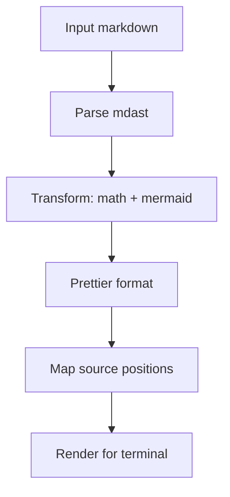
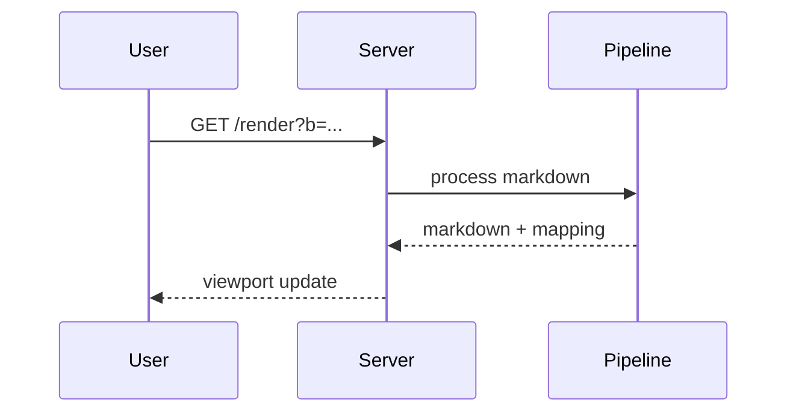

# Markdown Rendering Example

https://github.com/tani/mdd

This document exercises most syntax supported by `mdd`.

## Headings

### H3

#### H4

##### H5

###### H6

## Text Styles

Plain text with **bold**, _italic_, ~~strikethrough~~, and `inline code`.

Math inline examples: $E=mc^2$, $\alpha + \beta \to \gamma$, and
$\int_0^1 x^2 dx$.

Link styles:

- Inline link: [OpenAI](https://openai.com)
- Reference link: [Deno docs][deno]

[deno]: https://docs.deno.com

## Lists

- Unordered item one
- Unordered item two
  - Nested item A
  - Nested item B

1. Ordered item one
2. Ordered item two
3. Ordered item three

Task list:

- [x] Parse markdown
- [x] Render math
- [ ] Improve diagram theme

## Blockquote

> This is a blockquote. It spans multiple lines.

## Code Blocks

```ts
export function add(a: number, b: number): number {
  return a + b;
}
```

```bash
deno run -A src/mdd.ts EXAMPLE.md
```

## Table

| Feature   | Status | Notes                                 |
| --------- | :----: | ------------------------------------- |
| GFM table |  yes   | column alignment should remain        |
| Math      |  yes   | rendered via tex renderer or fallback |
| Mermaid   |  yes   | converted to ASCII block              |

## Horizontal Rule

---

## Math Blocks

$$
\frac{d}{dx}x^n = nx^{n-1}
$$

$$
\sum_{k=1}^{n} k = \frac{n(n+1)}{2}
$$

## Mermaid





## Escaping

Use literal dollar signs like this: \$5.00.

Use escaped pipes in table-like text: a \| b \| c.

## End

Final paragraph with enough text to trigger wrapping for narrow terminal widths
and verify that line mapping still behaves reasonably across formatted output.
