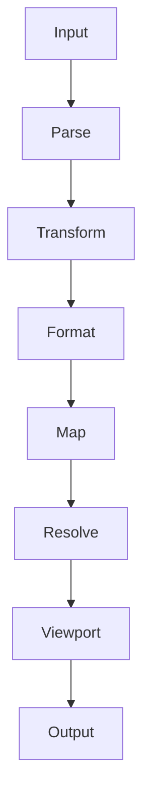

# mdd

Minimal terminal markdown preview service for `libtexprintf`.


## Features

- Markdown transform pipeline (GFM, math, mermaid, prettier)
- Source-to-formatted line mapping (`positionMap`)
- HTTP preview server and one-shot CLI render modes
- Static wasm-backed TeX rendering with safe fallback

## Quick Start

From `mdd/`:

```sh
deno task start
```

Default port: `8787`.

## Usage

Start server:

```sh
deno run -A src/mdd.ts --server
```

Start server on custom port:

```sh
deno run -A src/mdd.ts --server --port=8800
```

Render a file to stdout:

```sh
deno run -A src/mdd.ts README.md
```

Render stdin to stdout:

```sh
cat README.md | deno run -A src/mdd.ts
```

## HTTP API

`GET /render`

Query params:

- `b=<base64-utf8-markdown>` or `p=<path>` (required)
- `l=<line>` (optional, default `1`)

Status codes:

- `204` success
- `400` invalid input
- `404` unknown route
- `405` invalid method
- `500` internal error

## Processing Flow



## Public API

From `src/markdown/pipeline.ts`:

- `renderMarkdown(input, printWidth) -> { markdown, positionMap }`

From `src/markdown/terminal.ts`:

- `renderMarkdownToTerminalText(markdown) -> string`

## Development

Run tests:

```sh
deno task test
```

Typecheck + lint:

```sh
deno task check
```
